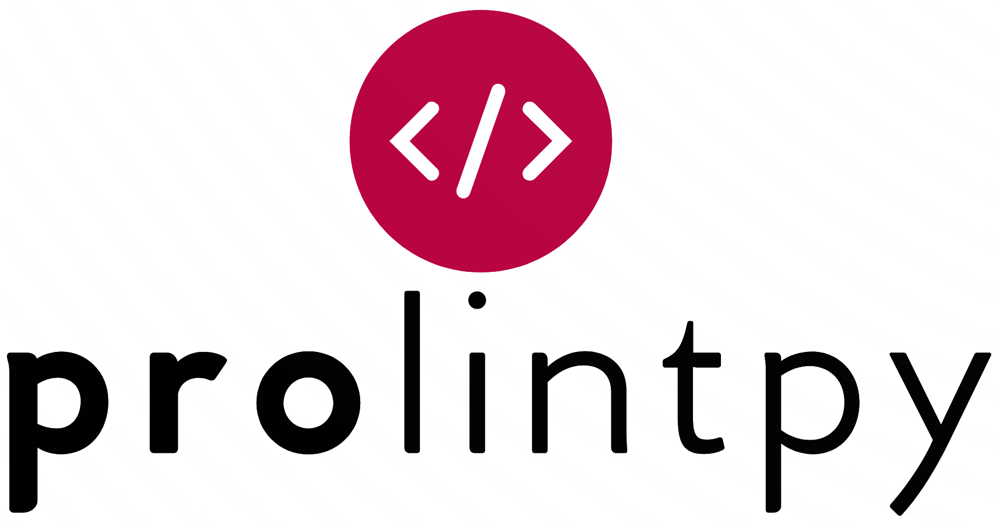

<a href="https://prolint.ca" target="_blank">
  

  

  </a>

> Gain quick insight into biologically-relevant lipid-protein interactions

- 🚀 Easy to automate and scale up
- ⚡️️ Simple, Powerful, & Intuitive API
- 🔥 Comprehensive, Highly detailed analysis
- 📊 Modern, Powerful, & Feature-rich Applications
- 📓 Easily save and manipulate data
- ⏳ Speed up research

  <a href="https://github.com/ProLint/prolintpy/" target="_blank">GitHub</a>
  <a href="#/README">Get Started</a>

