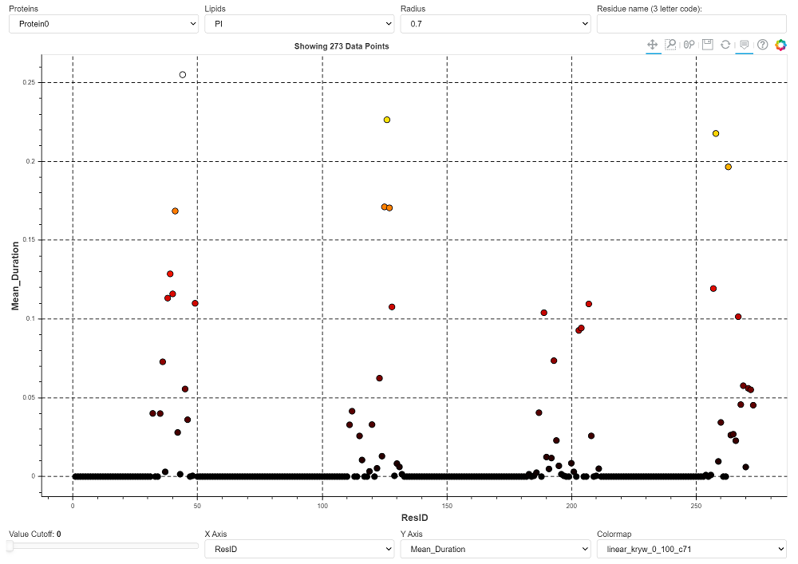
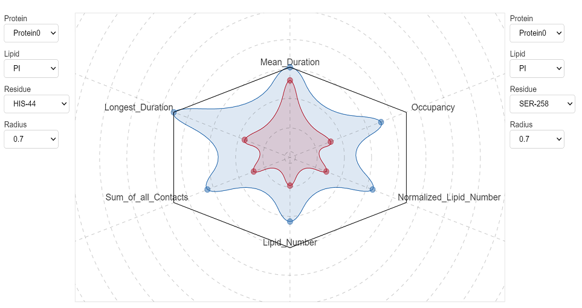
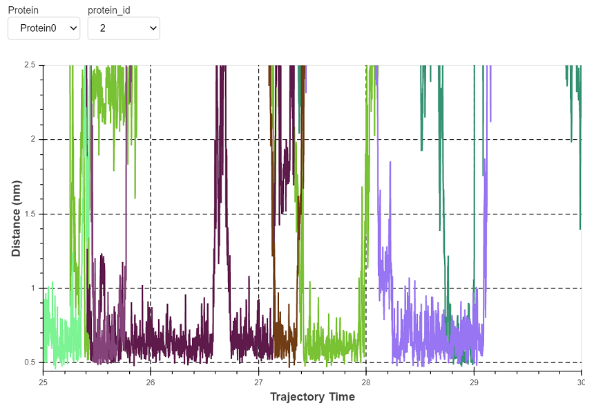
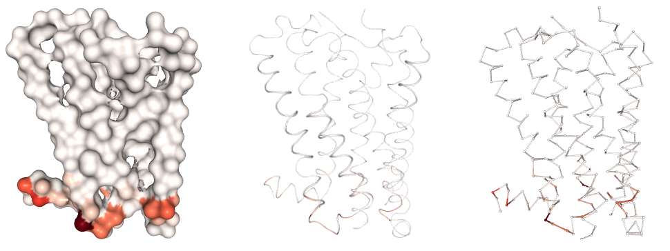
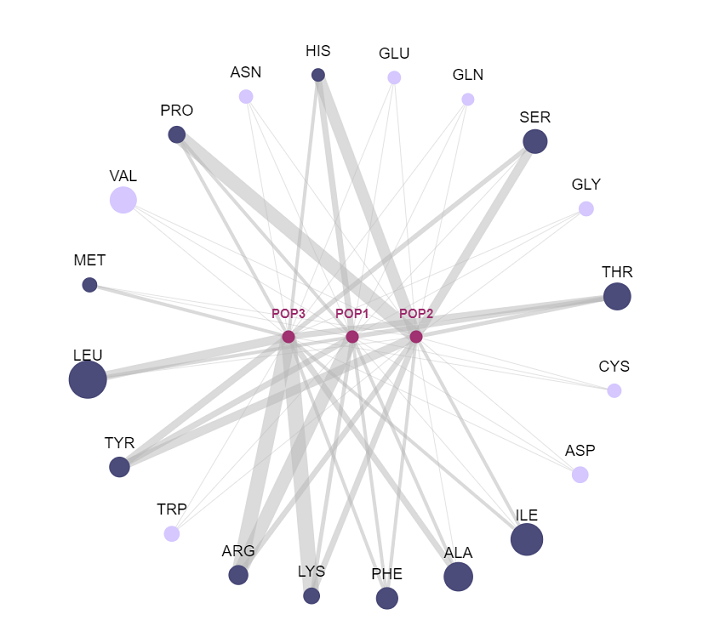

# Visualization Reference

`prolintpy` automates analysis and visualization of lipid-protein interactions. <br>
This section outlines how to use ProLint for for visualizing contact information using interactive applications.

In contrast to analysis, data visualization is more variable and different users will
have different preferences for how to best display results. `prolintpy` does not make any assumptions about the data or the preferences of the user.

Instead, the main objective is to allow users to quickly and without hassle obtain valuable insight on
protein-lipid interaction details in their simulated systems. To do this, it uses dedicated, modern,
popular and extremely powerful libraries that do that heavy
lifting in the background. All visualization tools supported by `prolintpy` are interactive and
are intended to give users complete access to their data.

Make sure you are using the JupyterLab environmet for this, and at the beginning execute:
```python
from bokeh.io import output_notebook
output_notebook()
```


### A scatter plot of data points

Once you have build a pandas DataFrame from the calculated contacts (by, for instance, running the `contacts_dataframe()` function),
you can provide it as input to the appropriate `prolintpy` visualization apps:

```python
pl.show_points(df, size=15)
```

When runing in a JupyterLab environment, will give the following output application:

</img>


### Metric comparison

Because by default ProLint calculates several contact metrics and users may add custom definitions,
you may want to see how these parameters compare against each other. In particular, this becomes
important when you have two or more residues that interact strongly with a lipid, and you want to
compare their interactions against each other. You can do this using ProLint by typing::

```python
pl.show_radar(df)
```


This will normalize all contact metrics (there should be at least three present) and use a radar plot
for the visualization:

</img>

### Distance calculations 1

A very important (perhaps the most important?) calculation that is commonly done in lipid-protein interaction studies is measuring the
distance between a residue and a lipid as a function of simulation time. This gives you a clear idea if the
lipid is interacting preferentially with a residue or not. `prolintpy` provides two different ways to get distance information on
lipid-protein interactions.

Calculate distances between lipids and residues without needing any contact-based metrics. Given a list of input residues,
this function will loop through all the lipids in the system and display distances with best ranking lipids. Ranking is decided
based on the following parameters:

| Argument       | Default       | Description          |
| -------------- | ------------- | -------------------- |
| distance_co    | 0.7           | A cutoff distance (nm) that a lipid must satisfy for `percentile_co` frames of the trajectory.|
| percentile_co  | 0.05          | The percentage of the trajectory (measured in frames) that a lipid must be within the `distance_co` for it to be stored. |


Here is an example application:

```python
# Calculate contacts for the first protein in the system and residues in the range 80-119 with cholesterol
dist = contacts.compute_distances(t, proteins[0], [*range(1, 10)], 'CHOL', 'ROH', percentile_co=0.05, distance_co=0.7)
pl.show_distances(dist)
```

You'll get an output like the following (note that the actual application also has a dropdown menu to select the residue which is not shown in this image):

</img>


### Heatmap & Density Viewer

NGL Viewer based application to visualize contact metrics as contact heatmaps that are projected on the
surface of the protein. You visualize it in `prolintpy` using:

    pl.show_contact_projection(t, df.Longest_Duration.to_list(), proteins[0])

In the first argument we give information about the topology of the system, in the second we provide
the contacts and in the third argument we tell `prolintpy` which protein to use. We can also use the
`ngl_repr` argument to specify the structure representation. For example, if we use options like:
`surface`, `cartoon`, or `ball+stick` we get the following outputs:

</img>

Please note that `prolintpy` uses the nglview library. So this application is intendent to cover a majority
of use cases when it comes to visualizing contacts with lipids, but obviously it is not intendent to be
comprehensive or provide many options.

Also note that currently only `martini` simulations are supported for this visualization and support for `atomistic` input files
will be added very soon.

### Graph Network

Lipids and proteins are represented as nodes and their interactions with each other as edges.
The width of the latter corresponds to the degree of the underlying interaction. To visualize
lipid-protein interactions as a graph network you execute the following commands:

```python
pl.network(lipids, df, df.columns[1], grouped=True, filename='network.json')
pl.show_network('network.json')
```

In the first command, we store the interactions in a json file and then visualize them in the second
command. This will give an output like this:

</img>

The size of lipid nodes corresponds to the ratio of that particular lipid group in simulated systems.
The size of residue nodes corresponds to the relative content of each residue in the protein being shown.


